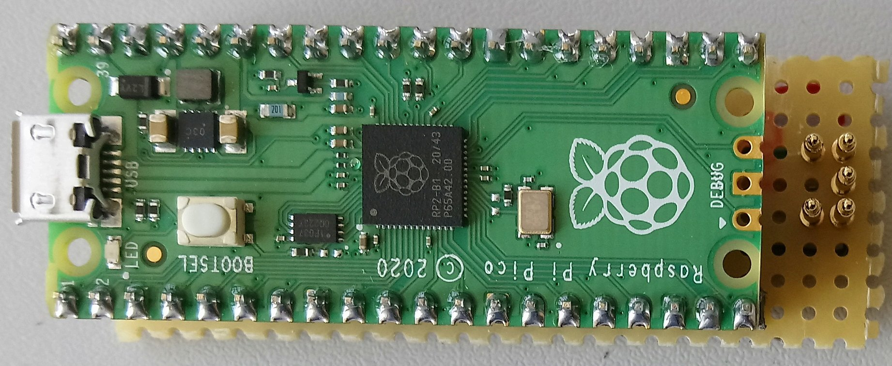

# EDGB kompatibler Programmier Adapter für den Arduino Nano 33 IoT

Prof. Dr. Mathias Moog, Hochschule Ansbach, 2022 

Dieses Lernmaterial habe ich zum Gebrauch an der Hochschule Ansbach erstellt.

Es steht unter der Creative-Commons-Lizenz Namensnennung -
Nicht-kommerziell - Weitergabe unter gleichen Bedingungen 4.0
International. Um eine Kopie dieser Lizenz zu sehen, besuchen Sie
<http://creativecommons.org/licenses/by-nc-sa/4.0/>.

## Kurzfassung

  Die Arduino Nano 33 IoT Boards sind recht empfindlich. Während meinen
  Kursen fallen jeweils mehrere aus, die sich nicht mehr programmieren
  lassen. Meist sind die Boards nicht kaputt, aber es muss ein neuer
  Bootloader bzw. ein Sketch per Programmer gebrannt werden.\
  Kommerzielle Atmel EDGB kompatibel Programmer sind rar, teuer und
  haben keinen Adapter für den Arduino Nano 33 IoT
  <https://store.arduino.cc/arduinonano-33-iot-with-headers>. 
  Daher habe ich einen kleinen Aufbau auf einer
  Lochaster Platine mit Pogo Pins entworfen, der zusammen mit einem
  Raspberry Pi Pico 
  <https://www.raspberrypi.com/documentation/microcontrollers/raspberry-pi-pico.html> 
  und der Firmware von
  <https://github.com/ataradov/free-dap> als Programmieradapter dient. 
  
  Der Adapter ist keine hochpräzise Profilösung und etwas Fummelei ist für die korrekte Kontaktierung notwendig,  aber für die gelegentlichen Uploads
  reicht es vollkommen aus.

Funktionalität
==============

Programmieradapter an den PC anschließen, wird automatisch als Atmel
EDGB kompatibler Programmer (CMSIS-DAP) erkannt.

Nano 33 IoT so aufstecken dass die Pogo Pins die fünf Felder des
Programmierinterfaces treffen. Ist etwas fummelig. Die (optionale)
Führung hilft dabei, siehe folgende Abbildungen. Der Ardino wird über den
Programmieradapter mit Spannung versorgt. Die LED am Arduino leuchtet
sobald der Kontakt hergestellt wurde.

In Arduino IDE den Atmel EDGB Programmer wählen. Diese besitzt keinen
eigenen COM Port, sonder wird direkt als USB Gerät gefunden.
Anschließend kann ein Bootloader gebrannt werden oder ein neue Sketch
mit dem Programmieradapter aufgespielt werden.

Wiederbeleben von Arduino Nano 33 IoTs
--------------------------------------

Typisches Verhalten: Der Arduino Nano 33 IoT wird nicht mehr vom PC
erkannt und kann daher auch nicht mehr programmiert werden.

In den meisten Fällen reicht es nur den Blink Sketch per Programmer
hochzuladen. In besonders hartnäckigen Fällen muss der Bootloader neu
gebrannt werden.

Recherche
=========

Das Problem mit nicht mehr ansprechbaren Arduino Nano 33 IoT Boards
tritt häufiger auf:

<https://forum.arduino.cc/t/arduino-nano-v3-set-as-arduino-as-isp-to-load-bootloader-into-nano-33-iot/607769>

Adafruit bietet einen Programmieradapter an,
<https://github.com/adafruit/Adafruit_DAP>. Nachteilig an dieser Lösung
ist, dass die Firmware für den Nano auf eine SD Karte geschrieben werden
muss.

Auf diese Weise lösen recht viele das Problem:

-   <https://arduino.stackexchange.com/questions/69579/nano-33-iot-rescue-from-the-dead-no-usb-no-upload-mode>

-   <https://arduino.stackexchange.com/questions/72955/arduino-nano-33-iot-issue>

-   <https://forum.arduino.cc/t/unbrick-nano-33-iot/644386/2>\
    Schöne Schritt für Schritt Anleitung analog zu Adafruit, aber auch
    Verweis auf Alternativen Interessant ist "CMSIS-DAP debug probe as
    programmer", diese ist EDGB Kompatibel:
    <https://www.tindie.com/products/ataradov/cmsis-dap-compliant-swd-debugger> -
    jedoch im Jahr 2022 / 2023 nicht lieferbar.

Der letzte Punkt ist der interessanteste, denn der Entwickler Alex
Taradov bietet die notwendige Firmware für den Programmieradapter über
Github als freie Software an, <https://github.com/ataradov/free-dap>. Insbesondere bietet
er sie fertig compiliert für den Raspberry Pi Pico an.

Nachteilig an allen gefunden Lösungen ist, dass ein keine einfache
Möglichkeit der Kontaktierung gibt. Nach (und manchmal auch während)
meinen Mikrocontroller Kursen muss ich einige Nanos wiederbeleben.

Bei meiner Recherche bin ich noch auf
<https://per1234.github.io/ino-troubleshooting/burn-bootloader.html>
gestoßen, eine Übersicht über ganz viele Boards und die Möglichkeiten
die Bootloader zu brennen.

Schaltung
=========

Die Schaltung ist sehr einfach, es müssen nur die fünf Programmierpins
(Nächste Abbildung, aus <https://bigdanzblog.wordpress.com/2022/05/06/writing-new-boot-loader-to-arduino-nano-33-iot/>) mit den entsprechenden Pins des Raspberry
Pi Pico  verbunden werden. In
<https://github.com/ataradov/free-dap> werden mehr pins aufgelistet, die hier jedoch nicht
benötigt werden, dafür habe ich die Spannungsversorgung in der Tabelle
ergänzt.

   GPIO   PIN   Funktion
  ------ ----- -----------
    11    15    SWCLK/TCK
    12    16    SWDIO/TMS
    15    20      RESET
          38       GND
          36      3,3 V

![Programmierpins am Arduino Nano 33 IoT, aus
[@dan:bootloader:nano:iot]](Bilder/nano33ioticsppins.png)

Firmware
========

Unter <https://github.com/ataradov/free-dap> steht die Firmware für den Raspberry Pi Pico
zum Download als UF2 Datei bereit.

Der Raspberry Pi Pico muss mit gedrückter BOOTSEL Taste an den PC
angeschlossen werden. Er erscheint als
Massenspeicher. Die Firmware Datei wird auf den Massenspeicher
geschoben. Sie wird dort sofort verarbeitet, der Raspberry startet neu
und meldet sich direkt als CMSIS-DAP Adapter.

Platine
=======

Da nur fünf Pins verbunden werden müssen habe ich die Schaltung auf
einem Reststück Lochraster Platine aufgebaut, nächste Abbildungen. Der
Raspberry Pi Pico wird auf die Steckleisten gesteckt (ich hatte keine
mit 20 Pins in der Bastelkiste). Die Pogo Pins sind etwas zu nah an dem
Raspberry PI, die Nanos mit meiner Schutzhaube <https://www.thingiverse.com/thing:4163355>
stoßen an den Pico an, ich musste etwas feilen ...

Die Lochraster Platine dient gleichzeitig als Führung, das letzte
Beinpaar passt genau in die Platine. Der Abstand zwischen den beiden
Platinen erlaubt etwas Spiel. Die Pins passen nicht immer richtig gut
auf die Kontakte.

Zur besseren Positionierung der Kontakte habe ich eine Führung (Datei
`Druck/Fuehrung.scad`, nächste Abbildung  gedruckt.

Mehr zu den gedruckten Objekten im folgenden Abschnitt.

3D Druck
========

Die Pogo Pins müssen sehr gerade auf der Platine sitzen, dafür habe ich
einen Adapter gedruckt `Druck/PogoPinLoethilfe.scad`. Damit der
Programmieradapter gut auf dem Tisch steht habe ich ein Unterteil
gedruckt, das ich mit Heißkleber unter der Platine fixiert habe
`Druck/Unterteil.scad`. Beide sind in den nächsten Abbildungen zu sehen.
Die Führung zur Platzierung der Nanos auf dem Programmieradapter wurde
schon im vorangegangen Abschnitt besprochen.

Die Pogo Pins habe ich vermessen, die Platte, die auf der Platine
aufsitzt habe einen Durchmesser von 2 mm und eine Höhe von 0,5 mm. Der
Stift hat einen Durchmesser von 1,5 mm.\
Für die Adapter habe ich ich das Loch für den Stift auf 2 mm
eingestellt, sonst passt der Stift nicht in das Loch. In der Führung und
der Löthilfe habe ich die Scheiben an den Pogo Pins berücksichtigt, die
auf der Platine aufliegen.

Material
========

Die Materialliste ist sehr überschaubar

  ------ --------------------------------------------
    Anz. Beschreibung
       1 Raspberry Pi Pico
       2 Steckleisten, 2,54 mm Raster, 20 Pin
       5 Pogo Pins
       1 Stück Lochraster Platine, ca. 22,5 x 65 mm
  ------ --------------------------------------------

Für die Verkabelung wird etwas isolierte Litze benötigt.

